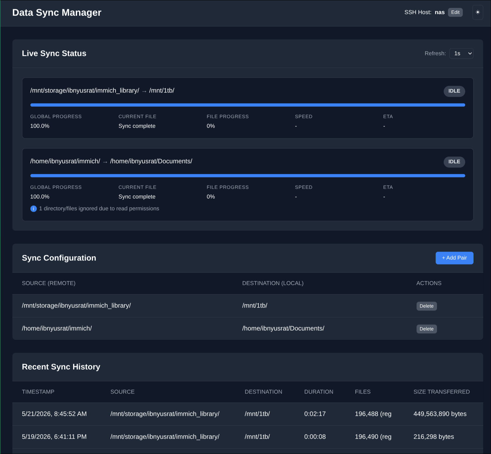

# Sync Manager

A robust, web-based rsync management tool designed to synchronize directories from a remote host (e.g., a NAS) to a local machine with real-time monitoring and graceful error handling.



## 🚀 Features

- **Real-time Monitoring**: Track sync progress, speed, ETA, and current file being transferred through a clean web interface.
- **SSH Integration**: Sync directories from remote hosts using secure SSH connections.
- **Automated Scheduling**: Periodically syncs directory pairs to keep your local copies up to date.
- **Graceful Error Handling**: 
    - Automatically detects unreadable directories (permission errors).
    - Skips unreadable content while successfully syncing everything else.
    - Provides a visual indicator ("i" icon) in the UI with a detailed list of ignored paths.
- **Customizable Exclusions**: Support for rsync-style exclude patterns to skip specific files or directories.
- **Sync History**: Keeps track of past sync sessions including duration and data transferred.
- **Dark Mode**: UI supports both light and dark themes for comfortable viewing.

## 🛠️ Tech Stack

- **Backend**: Python 3, FastAPI, SQLite
- **Frontend**: Vanilla JavaScript, HTML5, CSS3 (No heavy frameworks, fast and light)
- **Engine**: Rsync (utilizing `rsync -azP --delete`)
- **Service**: Systemd integration for background operation.

## 📋 Prerequisites

- Linux (Ubuntu/Debian recommended)
- Python 3.x
- `rsync` installed on both local and remote machines.
- SSH key-based authentication configured for the remote host.

## ⚙️ Installation

1. **Clone the repository:**
   ```bash
   git clone <repository-url>
   cd sync-manager
   ```

2. **Run the setup script:**
   ```bash
   chmod +x setup.sh
   ./setup.sh
   ```
   The setup script will:
   - Create a Python virtual environment.
   - Install dependencies.
   - Initialize the SQLite database.
   - Configure systemd services (`data-sync.service` and `data-sync-web.service`).

3. **Start the services:**
   ```bash
   sudo systemctl start data-sync data-sync-web
   ```

## 🖥️ Usage

1. Open your browser and navigate to `http://localhost:8000`.
2. Configure your **SSH Host** (e.g., `nas` or `user@192.168.1.100`).
3. Add **Directory Pairs**:
   - **Source**: The path on the remote machine (e.g., `/mnt/storage/photos/`).
   - **Destination**: The path on the local machine where you want to sync.
   - **Exclude (Optional)**: Patterns to ignore (e.g., `node_modules`, `temp`).
   - **Removing Pairs**: You can remove a sync pair at any time. This will stop the synchronization for those directories but will **NOT** delete any files from your disk.
4. The system will automatically start syncing the pairs in the background.
5. **Manage History**: You can view recent sync sessions in the History section, navigate through pages, or clear the history if it becomes too large.

## 🔍 Troubleshooting

### Permission Denied Errors
If the system encounters directories it cannot read (common with Docker volumes or system folders), it will:
1. Log the occurrence.
2. Mark the sync as "Complete" (for readable files).
3. Show an **Info Icon** in the dashboard.
4. Clicking the icon will reveal the exact paths that were skipped.

## 📄 License
MIT
